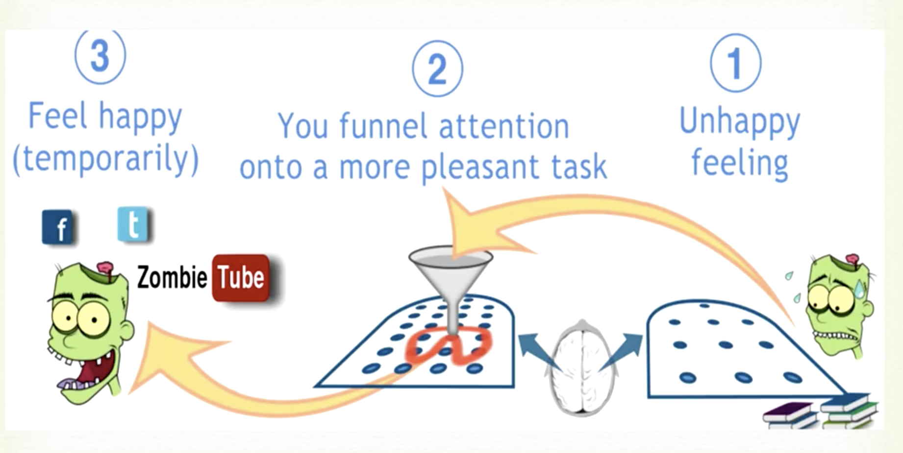
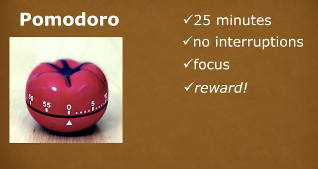

+++
toc = false
draft = false
comments = false
slug = ""
title = "Learning How to Learn Part 1"
date =  2017-09-09T16:52:23-04:00
+++

Recently I decided to take the most popular course on Coursera : [Learning how to learn][1]. 

# Motivation

I had been trying to go over [deep learning course][2] on fast.ai and somehow I was not making progress and hence started to procrastinate. In retrospect there are a few reasons I can think of, as to why I gave up on the course(for the time being) :

* I decided to deep dive into it and thought that I can do a quick glance of the course in a few weeks whereas the recommended time to finish the course is 3 months.
*  I watched 2 videos (out of 7) along with the homework in 4 days but realized that I was not retaining much knowledge. 
*  The python libraries that were used in the first 2 lectures seemed like magic to me. The professor did mention that what these libraries were doing will be studied in detail later on, but I did not have the  patience and started to learn about them, taking on more work.  

Hence I was overwhelmed and there being no pressing need to for me to learn about deep learning, I started to look at other interesting things to do. 

That is when I found out about the learning how to learn course. The timing seemed pretty apt so I decided I would take the course. The takeaways I was looking for were exactly what the course title suggests : learning how to learn new subjects. 

As I am taking the course I will outline my notes here. This post consists of the notes from week 1 of the course.

# Learning how to learn

# Week 1
### Focused and diffused modes
* Analogies help a lot while learning. Associations to existing concepts is helpful. 
* Mind works in focussed and diffused modes. 
    * Work in focused mode for some time and then in diffused mode. 
    * Let your mind run free for some time. 

### Procrastination 

#### Pomodoro 

* Similar to intense workout followed by relaxation. 

### Practice makes perfection
* When you first see a solution to a problem, the neural pattern of the solution in your brain(though present) is weak. 
* When you solve the problem the second time on your own, without looking at the solution, the neural pattern becomes stronger. 

### Introduction to memory
* Two types of memory : long term memory and working memory. 
* Working memory : Related to what you are working right now. 
    * Repetition is sometimes needed to keep stuff in working memory, until we have a chance to write the content down. 
* Longterm memory 
    * Store fundamental concepts about various subjects. 
* Spaced repetition : 
    * Repeat the thing you are trying to learn over several days.
    * Don't try to repeat one thing 10 times in one day. Span it across days. 

### Few extra points
* Learn by active engagement rather than passive listening. 
    * Reading tutorials is a good starting point but *learning by doing* is important. 
* Success does not come alone with smartness. 
    * Common qualities amongst successful people are persistence and being passionate about the work they do.

[1]:https://www.coursera.org/learn/learning-how-to-learn/home
[2]:http://course.fast.ai/