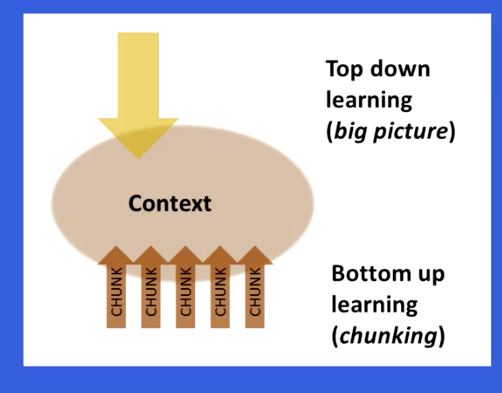
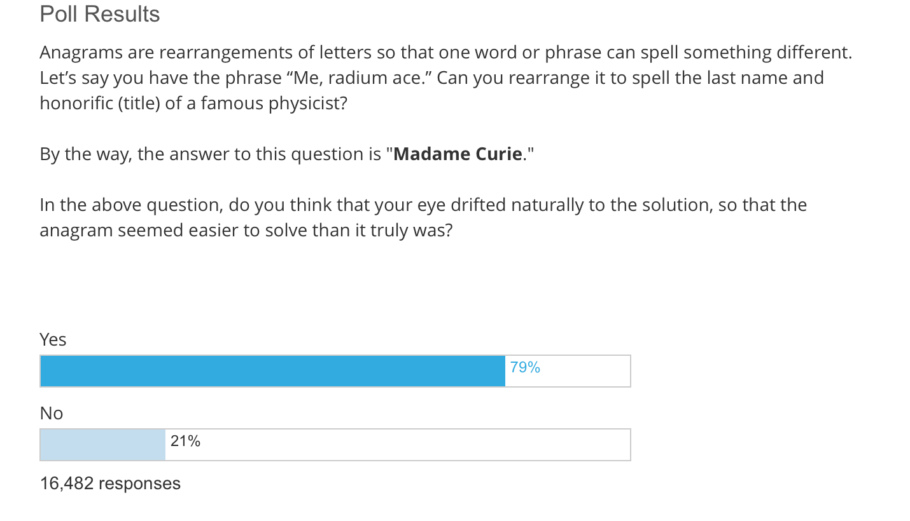

I recently enrolled myself in 'Learning how to Learn' course on coursera. [Part 1](../learning-how-to-learn-1) of this series listed my motivations for doing so, and summary of week 1 of the course.

Before summarizing my learnings from week 2, I would like to go over the things that have stuck with me from week 1. These techniques have passed the test of time(a month, hah) :

* [Pomodoro Technique][1] :  I have found this to be very effective. I now work on things 25 min at a time, and try not to be distracted in between. I don't know if my productivity has increased but my focus and attention span sure has. 
* Solving problems without looking at solutions : I have not been able to use this as much as I would have liked, but a few times that I got the opportunity, I came out with a better understanding of the subject.

Week 2 of the course focussed on chunking information i.e. breaking down information into smaller logical pieces. It also went over the concepts of 'illusion of competence' and 'reward based learning'([Treat. Yo. Self][2])

# Chunks

A chunk is a logical part of a big picture. Think of a book chapter as a chunk. Each chapter of a book keeps the larger picture in mind while being focussed on the particular aspect of the picture in it. Our mind similarly works with chunks while we are learning a new subject. 

## How to form a chunk

Lets take the example of learning soccer. At first we will learn few techniques and practice them individually. For example running with the ball and dribbling it. Each technique is a chunk. Sooner than you know, our mind would have combined related techniques and we can dribble and run at the same time. This is our mind combining chunks to form big ones. 

Focus is important to form a chunk. So try to stay away from noise like television, internet etc. At the same time, stress is harmful and our brain has difficulty forming chunks while stressed.   

Reviewing an idea is important for the brain to form a chunk. After you have understood an idea, review it. Doing a task is more important than listening or seeing. Practicing related problems helps while reviewing. 

## Top down vs bottom up learning. 

Chunks are formed when we are doing bottom up learning. Another school of thought is top down learning. Where we start with the big picture and delve deep into details as and when required. A healthy mixture of both is what is required when learning a new subject. 

Glancing the headings, looking at pictures etc help in understanding the larger picture and what belongs to one chunk and not to the other. Even skipping ahead sometimes is helpful, focus on larger picture, not necessary to get all details right the first time around.

# Illusion of competence.

A lot of times we read something and think that we understand it and move on to the next topic. Our mind tricks us into believing that we have understood the topic just by reading. This is called illusion of competence. More often than not what happens then is that we need to come back to the topic later again and again and eventually might sometimes just give up.  

Getting basics right is important and practicing helps us avoid the above situation. Re-reading is less productive than recalling. Re reading helps more if there has been sufficient time in between. 

Sometimes even while practicing, we just glance at the solution , think we get it, and move on. This is also illusion of competence. Here is a poll which was taken in the course. See how most of the people answered yes. 

Few things to keep in mind while learning :

* Highlight one sentence or less per paragraph.
* Highlight in the second reading. At this point you know what is worth highlighting and what's not. 
* Mistakes are very valuable while testing and they correct your thinking. 
* Recall in a different environment if possible. It helps in strengthening your grasp.

# What motivates you

Motivation is a very important part of learning. [How Motivation Affects Learning and Behavior](https://www.education.com/reference/article/motivation-affects-learning-behavior/) is a good article on the subject. 

Its important to find what motivates you and tangible rewards are better than intangible ones.  The idea of treating yourself once you finish learning is also a motivation. 

Ending summary : 

* Remember not to get overwhelmed, it gets easier. 
* Be prepared to give in the time, a 20 min ted talk usually takes 70 hours to prepare.
* Start with the basics, don't jump into the water without learning how to swim. 
* Keep an open mind and don't be afraid to think out of the box. "Science progresses one funeral at a time."
 

[1]:https://en.wikipedia.org/wiki/Pomodoro_Technique
[2]:https://www.youtube.com/watch?v=ZsABTmT1_M0