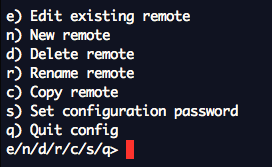
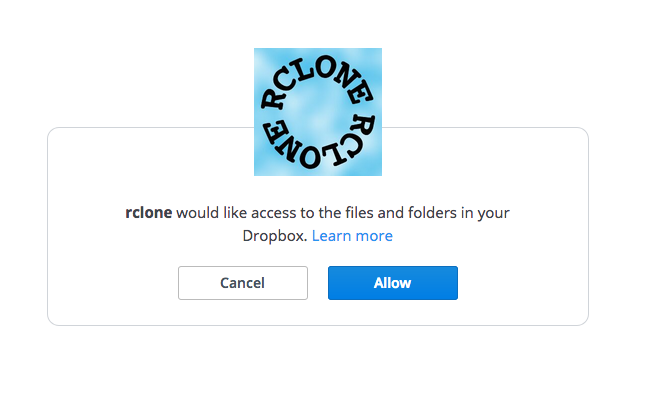
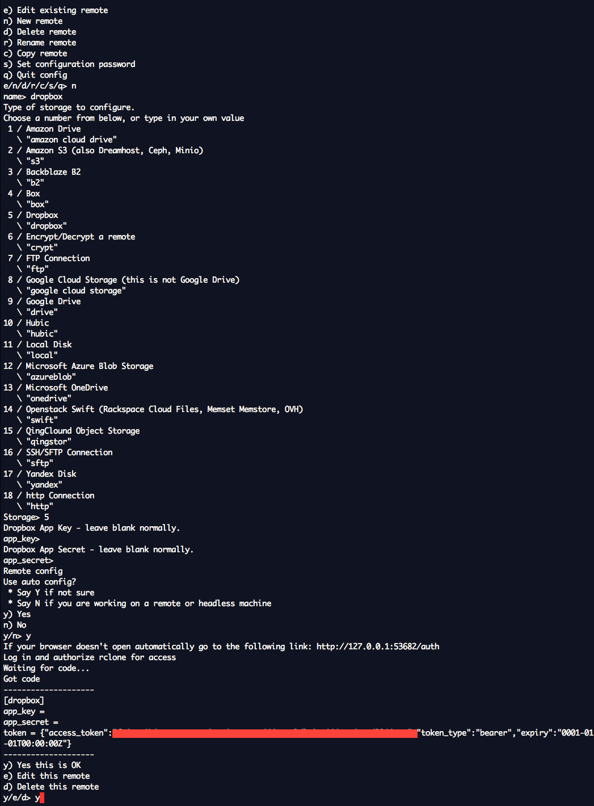
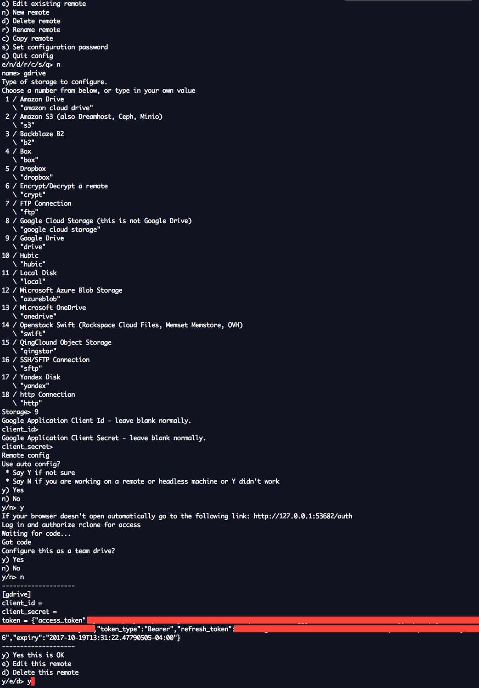

[Rclone][1] is a command line program to sync files and directories to and from various cloud service providers. 

Among others, it supports Google Drive, Dropbox, Amazon Drive, Box, Microsoft One Drive, Yandex and Backblaze. An exhaustive list can be found over [here][2]. 

This is a mental dump of how to setup rclone and sync between dropbox and google drive. I generally store my files in Google drive and then once a month sync them over to dropbox and backblaze. I use Google drive mac app for syncing to Google and rclone for all others. 

# Setup Rclone

Rclone is a command line tool and can be used on Windows, osx, linux, freeBSD etc. If it interests you, rclone is written in [golang][4] which has easy cross compilation, hence it can support a bunch of OS's. You can find the binaries for rclone over [here][3]. If you use macOS, then you can use homebrew i.e. `brew install rclone`. 

Once installed, we will setup both Google Drive and dropbox for rclone. 

## Configuration for dropbox

We will use terminal. Use terminal app of your choice. (terminal app for mac, command prompt for windows etc)

1) `rclone config` is used to config rclone. On doing this you will see the following menu.
   

2) Remotes simplified are various cloud providers. Press `n` for new remote. 

3) Name it 'dropbox'. 

4) Choose 'Dropbox' from list of providers. At the time this was written it was number 5. 

5) Leave 'Dropbox App Key' empty i.e just press enter key. 

6) Leave 'Dropbox App Secret' empty  i.e just press enter key.

7) Use auto config? Y

8) Rclone will launch dropbox will launch your browser asking for permission. Allow.

9) You will see the token field in the terminal. Press 'y' to save the remote. 

The whole setup looks like the following:

As you can see, it is very intuitive.

## Configuration for Google Drive

It is very similar to dropbox's configuration. Here's an image showing the steps.

# Transfer files from dropbox to google drive

Rclone [docs][5] are pretty exhaustive. We will be using 'copy' to copy files from one remote to another. 

Let's assume you have a folder on Google Drive named 'backup'. To transfer that folder to dropbox use 

`rclone copy gdrive:Backup/ dropbox:Backup/`

Few useful options of `rclone copy` are :

* `update` this will only copy the files which are newer on google drive than dropbox. So if you already have a file with same name in backup folder in dropbox, it will not overwrite that file if it is newer than gdrive's file.
* `dry-run` this will show you the files rclone will copy without doing any copy. Its useful sometimes to see you are not overwriting any file accidentally.

So generally I do this, `rclone copy gdrive:Backup/ dropbox:Backup/ --update --dry-run` and once everything looks good, then I run `rclone copy gdrive:Backup/ dropbox:Backup/ --update`.

I do a similar process for Backblaze(their setup has little more to it though).

This is how I keep my backup files in sync across multiple cloud providers.

[^1]:https://rclone.org/
[^2]:https://rclone.org/
[^3]:https://rclone.org/downloads/
[^4]:https://golang.org/
[^5]:https://rclone.org/docs/